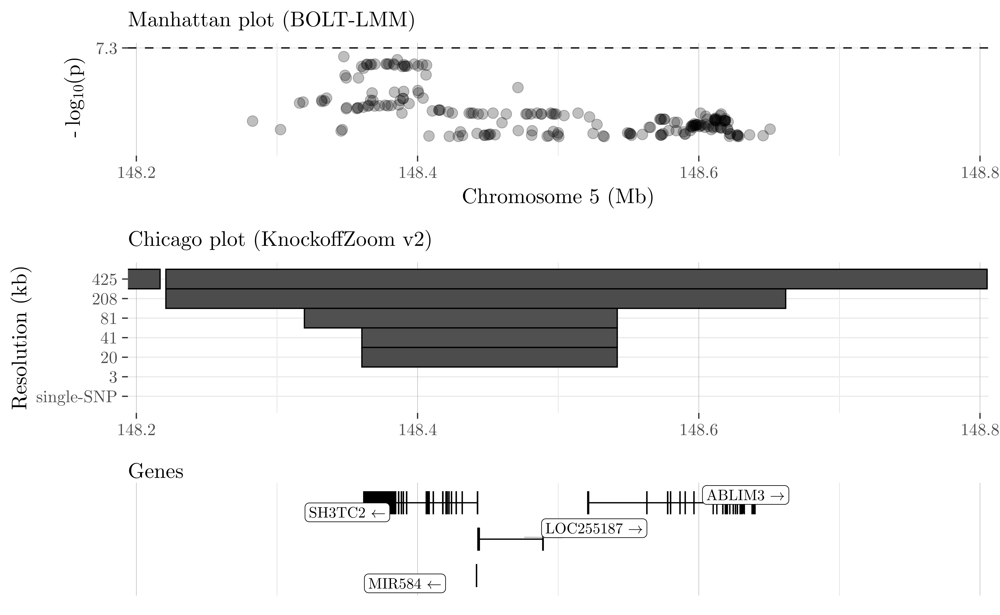

<head>
<!-- Global site tag (gtag.js) - Google Analytics -->

</head> 

KnockoffGWAS is a powerful and versatile statistical method for the analysis of genome-wide association data with population structure.

## Overview

*KnockoffGWAS* localizes causal variants precisely, controlling the false discovery rate even if the samples have diverse ancestries or close familial relatedness.
This method is equally valid for quantitative and binary phenotypes, making no assumptions about their genetic architectures. Instead, we rely on hidden Markov models for the distribution of haplotypes.

For more information, read the accompanying <a target="_blank" href="https://doi.org/10.1101/2020.08.04.236703">paper</a>:

<i>FDR control in GWAS with population structure</i> 
M. Sesia, S. Bates, E. Candès, J. Marchini, C. Sabatti 
Proceedings of the National Academy of Sciences, 2021; <a target="_blank" href="https://doi.org/10.1073/pnas.2105841118">doi:10.1073/pnas.2105841118</a>

For an earlier version of KnockoffGWAS restricted to homogeneous populations, see also [KnockoffZoom](https://msesia.github.io/knockoffzoom/).

&nbsp;

We partition the genome into contiguous LD blocks and test whether the trait is independent of
the SNPs in any block, conditioning on the others. The resolution of the hypotheses is determined
by the size and homogeneity of the LD blocks, which we choose in advance.
To balance power and resolution, we consider multiple partitions, starting with a coarse view and successively  refining it. Some of the results obtained at different resolutions for cardiovascular disease in the UK Biobank are visualized below.
