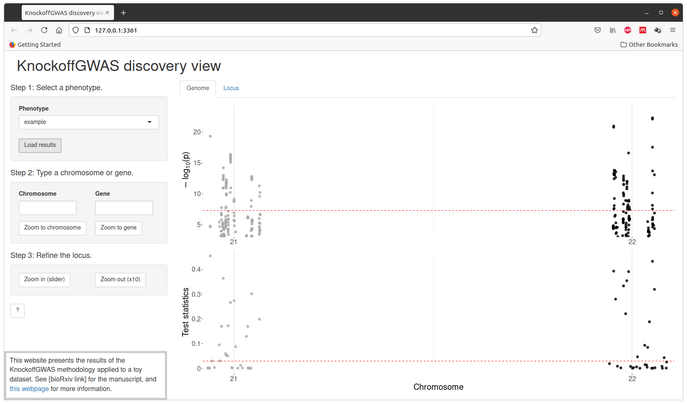
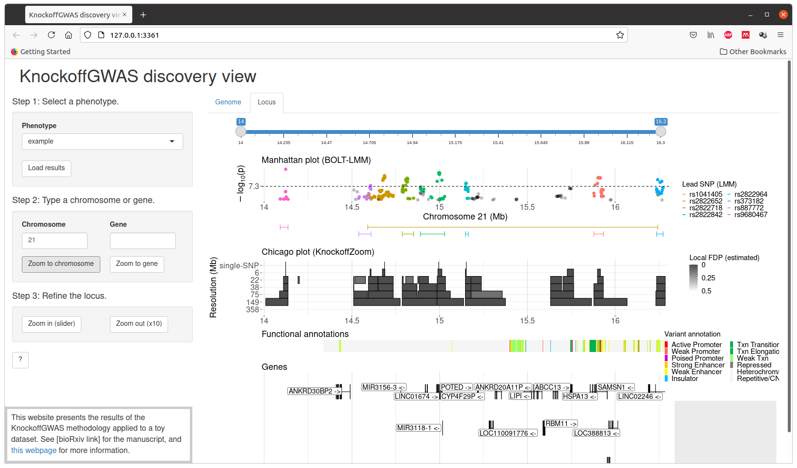

<head>
<!-- Global site tag (gtag.js) - Google Analytics -->
<script async src="https://www.googletagmanager.com/gtag/js?id=UA-110810441-3"></script>
<script>
  window.dataLayer = window.dataLayer || [];
  function gtag(){dataLayer.push(arguments);}
  gtag('js', new Date());

  gtag('config', 'UA-110810441-3');
</script>
</head> 

A toy genetic dataset containing 1000 artificial samples typed at 2000 loci (divided between chromosome 21 and 22) is available from the [software repository](https://github.com/msesia/knockoffgwas) as a tutorial for *KnockoffGWAS*. This data set contains both genotypes and phased haplotypes for all individuals, stored in the standard BED and BGEN formats accepted as input by *KnockoffGWAS*, along with the phenotype information and all necessary auxiliary files.
Note that this tutorial is intended to be run on a Linux system.

To run the tutorial, download the software repository and enter the corresponding main directory. Then, compile the *snpknock2* C++ program (to generate the knockoffs) by typing the following commands in your terminal:

```
cd snpknock2
make
cd ..
```

After a successful compilation, you can execute the script `analyze.sh` contained therein.

```
./analyze.sh
```

This will first verify whether the system dependencies (plink, R, and the snpknock2 executable compiled above), and then install any missing required R packages.
Then, it will carry out an entire association analysis which should take approximately 5 minutes on a personal computer from start to finish. 
This analysis consists of 4 main modules, each encoded by a distinct script located within the sub-directory `knockoffgwas/`, and all automatically coordinated by `analyze.sh`.
These modules organize the analysis as follows:

 1. **Genome partitions.** Partition the available SNPs into contiguous groups at different levels of resolution, based on the genetic distance information provided with the data and the desired resolution values (measured in cM) specified by the user (a default option is specified in `knockoffgwas/module_1_partition.sh`). The genome partitions computed by the module will be stored in the intermediate result directory `tmp/partitions`.

 2. **Knockoffs.** Generate knockoff genotypes for all specified genome partitions. This operation is carried out by the script `knockoffgwas/module_2_knockoffs.sh`, which executes the *snpknock2* program compiled above. The output knockoffs will be stored in standard BED format within the intermediate result directory `tmp/knockoffs`, merged with a copy of the original genotypes for subsequent convenience. A separate set of BED and auxiliary files will be produced for each available chromosome.

 3. **Statistics.** Compute knockoff test statistics for all groups of SNPs, separately for each specified genome partition. This operation is carried out by the script `knockoffgwas/module_3_statistics.sh`, which first merges the knockoff-augmented genotype files for all chromosomes and then converts them into a large [file-backed matrix](https://privefl.github.io/bigsnpr/). Finally, this script fits a sparse generalized linear regression model to predict the phenotype of interest given the knockoff-augmented data using a very [efficient implementation of the lasso](https://privefl.github.io/bigstatsr/), and utilizes that to compute the final knockoff test statistics, separately for each specified genome partition.

 4. **Filter.** The last module applies the knockoff filter to the statistics computed above, producing a separate list of discoveries for each specified genome partition. This operation is carried out by the script `knockoffgwas/module_4_discover.sh`. The default FDR level is 10%, but it can be modified within this script. The final lists of discoveries will be written in the directory `results/`.


<p style="text-align:center;">

</p>

The final results can be visualized interactively with the script `visualize.sh`, which will launch a [Shiny](https://shiny.rstudio.com/) app in your browser. Some additional R packages are required by the visualization tool, and will be automatically installed if not found.

```
./visualize.sh
```

<p style="text-align:center;">

</p>

The expected results for the analysis of this toy dataset are provided in the directory `results/` and can be visualized through interactive Chicago plots by running the script `visualize.sh` before running `analyze.sh`. Note that the script `analyze.sh` will overwrite the default results. 

<p style="text-align:center;">

</p>

<p style="text-align:center;">

</p>
