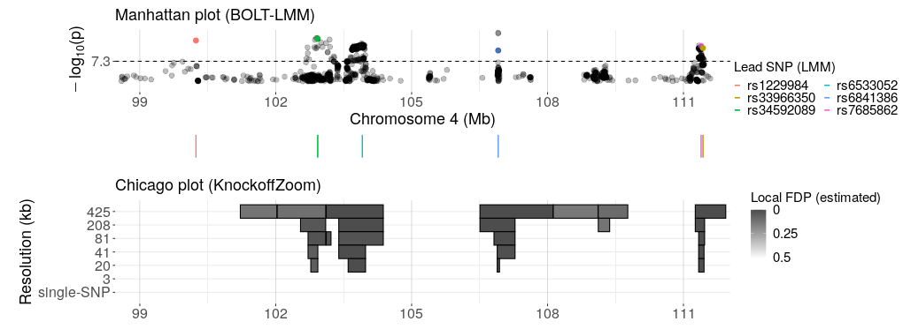

<head>
<!-- Global site tag (gtag.js) - Google Analytics -->

</head> 

## Pooled analysis of all populations

We apply KnockoffGWAS to several phenotypes in the <a target="_blank" href="https://www.ukbiobank.ac.uk/">UK Biobank</a> data and obtain many new findings. 
To learn more about this analysis and the method behind it, read the following accompanying paper.

<i>FDR control in GWAS with population structure</i> 
M. Sesia, S. Bates, E. Candès, J. Marchini, C. Sabatti 
preprint at bioRxiv; <a target="_blank" href="https://doi.org/10.1101/2020.08.04.236703">doi:10.1101/2020.08.04.236703</a>

To produce more plots like the one below and explore our results interactively, visit: <a target="_blank" href="https://sesia.shinyapps.io/knockoffgwas/">https://sesia.shinyapps.io/knockoffgwas/</a>.

<a target="_blank" href="data/ukb_discoveries.zip">Download</a> the complete list of multi-resolution *KnockoffGWAS* discoveries for each trait. 
<a target="_blank" href="data/ukb_stats.tar.xz">Download</a> the complete list of *KnockoffGWAS* test statistics at each resolution.

## Multi-population analysis searching for robust associations

The following paper applies KnockoffGWAS to the UK Biobank data to discover genetic associations that are invariant across populations with different ancestries.

<i>Searching for consistent associations with a multi-environment knockoff filter</i> 
S. Li, M. Sesia, Y. Romano, E. Candès, C Sabatti 
preprint at arXiv; <a target="_blank" href="https://arxiv.org/abs/2106.04118">https://arxiv.org/abs/2106.04118</a>

<a target="_blank" href="data/ukb_discoveries_invariant.zip">Download</a> the complete list of multi-resolution *KnockoffGWAS* invariant discoveries for each trait. 
